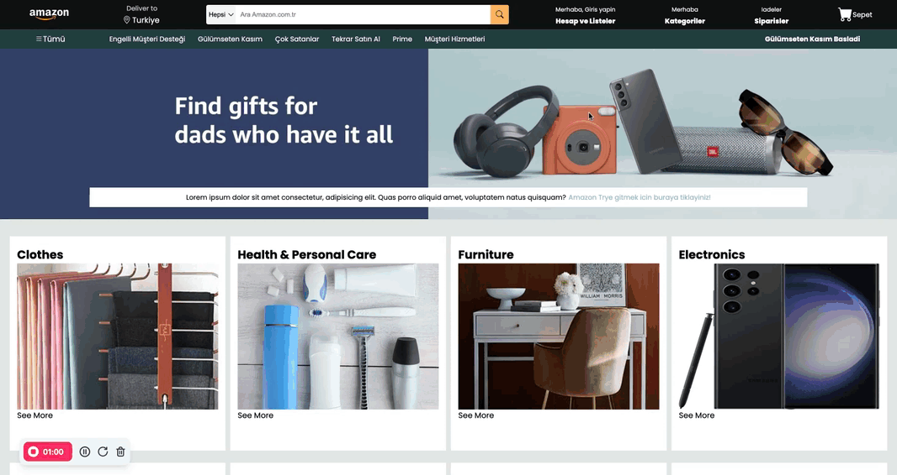

<h1>Amazon Clone</h1>

A responsive, elegant fastfood shop website built using HTML5 and CSS3. This site showcases the best features of a moder, customer reviews, and blog sections. With smooth transitions, a warm color palette, and a simple yet visually appealing layout

<h1>Preview</h1>

<h1>🧰 Technologies Used</h1>

HTML5 for structured content
CSS3 for styling and responsive design
Font Awesome icons for added visual appeal

<h1>📧 Contact</h1>
<a href="#">mraliagaa@gmail.com</a>
